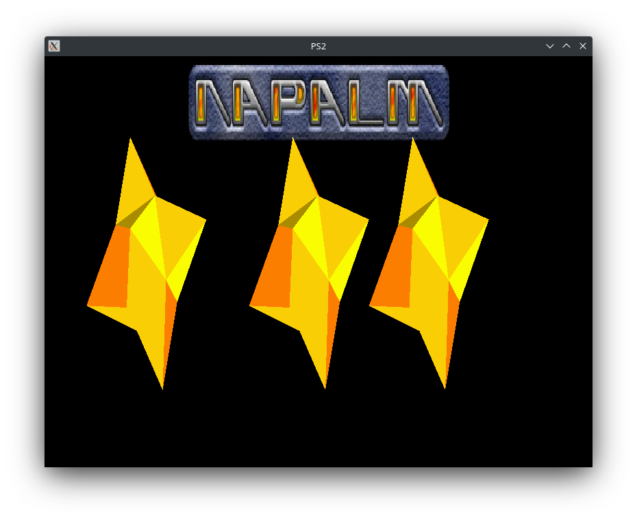

# PS2 Emulator

This is an experimental emulator for the Playstation 2 console. Currently the emulator can boot the original Japanese BIOS until the VUs are requested. Simple demos like 3stars can run albeit without any texture support.

The source is comprised of modern C++ to make the implementations simpler and safer. Some C++20 features are used including designated initializers while module support is planned for the future when CMake properly starts supporting them.

This project does not aim to replace existing PS2 emulators like PCSX2 and Dobietation. This is a personal hobby project with the goal of better understanding low level CPU and GPU architecture, as well as exploring new emulation techniques. The current implementation isn't particularly efficient nor user-friendly and doesn't try to be so.

## Features

* Working EE and IOP interpreters
* JIT compilation support for the EE
* Partial GS implementation with 32bit and 16bit texture swizzling.
* Working DMAC/GIF/VIF transfers.
* Hardware based Vulkan renderer
* CMake build system and cross platform support


## Screenshots
 

## Compiling

For building CMake is used with as well as Conan for dependency management. You can install conan in both Windows and Linux through pip:

```
pip install conan
```

### Linux

On most distros you can proceed with normal CMake and Conan building instructions

```
mkdir build && cd build
conan install .. --build=missing -s build_type=<Config>
cmake ..
cmake --build . --config <Config> -j8
```

### Windows

Due to the use of ranged switch statements compiling on Windows requires the use of clang-cl. Downloading clang can be easily achieved from the Visual Studio Installer if you already have it installed.

Begin by creating the following conan profile named 'clang_cl'. Make sure to adjust the Visual studio version according to your installation. Bellow Visual Studio 2022 is selected.

```
[settings]
arch=x86_64
build_type=Release
compiler=Visual Studio
compiler.version=17
compiler.runtime=MD
compiler.toolset=ClangCL
os=Windows
[options]
[build_requires]
[env]
```

You can then proceed with the build process

```
mkdir build && cd build
conan install .. --build=missing -s build_type=<Config> -p clang_cl
cmake -G "Visual Studio 2022" -T ClangCL ..
cmake --build . --config <Config> -j8
```
